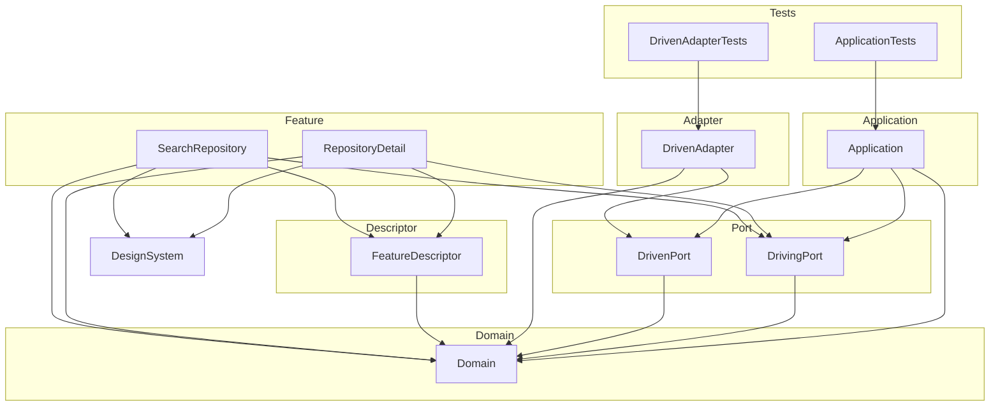

# Sandbox-MultiModule

Swift Packageのマルチモジュール構成の研究をするためのリポジトリです。
Hexagonal Architecture（Ports and Adapters）に基づいたパッケージ構成を採用しています。

## バージョン情報

- Xcode 26.2
- Swift 6.2

## パッケージ構成

Sandbox-MultiModule-Library内のパッケージ構成について解説

### Domain

ドメインモデルを定義する層。アプリケーション全体で使用するデータモデルを含む。

- **Domain**
  - アプリ全体で使用するデータモデルを定義する
  - 例: `SearchResultItem`, `RepositoryDetail`

### Application

アプリケーションロジック（UseCase）の実装を定義する層。

- **Application**
  - UseCaseの実装を定義する
  - DrivingPortで定義されたUseCaseインタフェースに対する`DependencyKey.liveValue`を提供
  - DrivenPortのRepositoryインタフェースを利用してデータを取得

### Port

各層のインタフェース（protocol相当）を定義する層。swift-dependenciesの`@DependencyClient`を使用。

- **DrivingPort**（Sources/Port/Driving）
  - FeatureやApplicationから参照されるUseCaseのインタフェースを定義する
  - `TestDependencyKey.testValue`とDependencyValuesへの登録を含む
  - 例: `SearchRepositoryUseCase`, `RepositoryDetailUseCase`
- **DrivenPort**（Sources/Port/Driven）
  - ApplicationやAdapterから参照されるRepositoryのインタフェースを定義する
  - `TestDependencyKey.testValue`とDependencyValuesへの登録を含む
  - 例: `SearchRepositoryRepository`, `RepositoryDetailRepository`

### Adapter

外部システムとの接続を担うアダプター層。

- **DrivenAdapter**（Sources/Adapter/Driven）
  - 外部API等のデータを取得するRepositoryの実装を定義する
  - DrivenPortで定義されたRepositoryインタフェースに対する`DependencyKey.liveValue`を提供
  - OpenAPI Generatorで自動生成されたAPIクライアントを使用

### DesignSystem

UIを構成するためのデザイントークンやコンポーネントを定義する層。

- **DesignSystem**
  - UIを構成するためのデザイントークンやコンポーネントを定義する

### Descriptor

Feature間の依存関係を解決するためのインタフェースを定義する層。

- **FeatureDescriptor**
  - Feature間の依存関係を解決するためのViewBuilderインタフェースを定義する
  - 他のFeatureの画面を生成するためのインタフェースを提供
  - 例: `SearchRepositoryViewBuilder`, `RepositoryDetailViewBuilder`

### Feature

アプリの画面（UI/プレゼンテーションロジック）を定義する層。画面ごとにターゲットを分割。

- **SearchRepository**
  - GitHubリポジトリ検索画面
  - `SearchRepositoryViewBuilder.liveValue`を提供
- **RepositoryDetail**
  - リポジトリ詳細画面
  - `RepositoryDetailViewBuilder.liveValue`を提供

### Tests

各モジュールのユニットテストを定義する層。

- **ApplicationTests**
  - Application層のUseCaseに対するテスト
- **DrivenAdapterTests**
  - Adapter層のRepositoryに対するテスト

