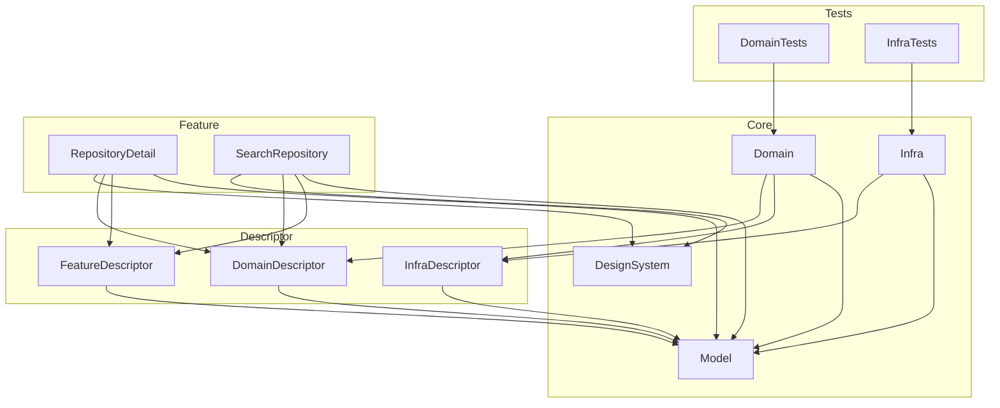

# Sandbox-MultiModule

Swift Packageのマルチモジュール構成の研究をするためのリポジトリです。

## バージョン情報

- Xcode 26.2
- Swift 6.2

## パッケージ構成

Sandbox-MultiModule-Library内のパッケージ構成について解説

### Core

実装の本体を含む層。

- **DesignSystem**
  - UIを構成するためのデザイントークンやコンポーネントを定義する
- **Domain**
  - UseCaseの実装を定義する
  - DomainDescriptorで定義されたUseCaseインタフェースに対する`DependencyKey.liveValue`を提供
  - InfraDescriptorのRepositoryインタフェースを利用してデータを取得
- **Infra**
  - 外部API等のデータを取得するRepositoryの実装を定義する
  - InfraDescriptorで定義されたRepositoryインタフェースに対する`DependencyKey.liveValue`を提供
  - OpenAPI Generatorで自動生成されたAPIクライアントを使用
- **Model**
  - アプリ全体で使用するデータモデルを定義する
  - 例: `SearchResultItem`, `RepositoryDetail`

### Descriptor

各層のインタフェース(protocol相当)を定義する層。swift-dependenciesの`@DependencyClient`を使用。

- **DomainDescriptor**
  - FeatureやCoreから参照されるUseCaseのインタフェースを定義する
  - `TestDependencyKey.testValue`とDependencyValuesへの登録を含む
  - 例: `SearchRepositoryUseCase`, `RepositoryDetailUseCase`
- **FeatureDescriptor**
  - Feature間の依存関係を解決するためのViewBuilderインタフェースを定義する
  - 他のFeatureの画面を生成するためのインタフェースを提供
  - 例: `SearchRepositoryViewBuilder`, `RepositoryDetailViewBuilder`
- **InfraDescriptor**
  - DomainやCoreから参照されるRepositoryのインタフェースを定義する
  - `TestDependencyKey.testValue`とDependencyValuesへの登録を含む
  - 例: `SearchRepositoryRepository`, `RepositoryDetailRepository`

### Feature

アプリの画面(UI/プレゼンテーションロジック)を定義する層。画面ごとにターゲットを分割。

- **SearchRepository**
  - GitHubリポジトリ検索画面
  - `SearchRepositoryViewBuilder.liveValue`を提供
- **RepositoryDetail**
  - リポジトリ詳細画面
  - `RepositoryDetailViewBuilder.liveValue`を提供

### Tests

各モジュールのユニットテストを定義する層。

- **DomainTests**
  - Domain層のUseCaseに対するテスト
- **InfraTests**
  - Infra層のRepositoryに対するテスト

