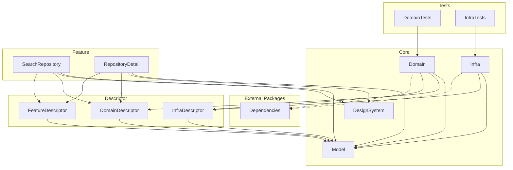

# Sandbox-MultiModule

Swift Packageのマルチモジュール構成の研究をするためのリポジトリです。

## バージョン情報

- Xcode 26.2
- Swift 6.2

## パッケージ構成

Sandbox-MultiModule-Library内のパッケージ構成について解説

- Core
  - DesignSystem
    - UIを構成するためのデザイントークンやコンポーネントを定義する
  - Domain
    - UseCase等のドメインロジックを定義する
  - Infra
    - 外部API等のデータを取得する処理を定義する
  - Model
    - アプリ全体で使うデータモデルを定義する
- Descriptor
  - Domain
    - Featureから参照されるUseCaseのインタフェース(protocol)を定義する
  - Feature
    - Feature間の依存関係を解決するためのインタフェースを定義する
  - Infra
    - Domainから参照されるデータ取得処理のインタフェース(protocol)を定義する
- Feature
  - アプリの画面のUI/プレゼンテーションロジックを定義する
  - 画面ごとにターゲットを分ける

