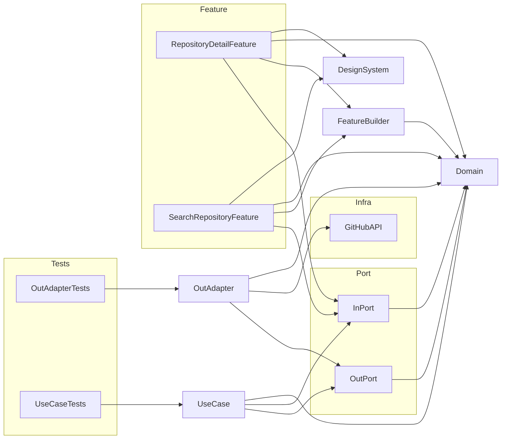

# Sandbox-MultiModule

Swift Packageのマルチモジュール構成の研究をするためのリポジトリです。
Hexagonal Architecture（Ports and Adapters）に基づいたパッケージ構成を採用しています。

## バージョン情報

- Xcode 26.2
- Swift 6.2

## パッケージ構成

Sandbox-MultiModule-Library内のパッケージ構成について解説します。
Hexagonal Architectureをベースにしています。

### Domain

ドメインモデルを定義する層。アプリケーション全体で使用するデータモデルを含む。

- **Domain**（Sources/Domain）
  - アプリ全体で使用するデータモデルを定義する
  - 例: `SearchResultItem`, `RepositoryDetail`

### UseCase

アプリケーションロジック（UseCase）の実装を定義する層。

- **UseCase**（Sources/UseCase）
  - UseCaseの実装を定義する
  - InPortで定義されたUseCaseインタフェースに対する`DependencyKey.liveValue`を提供
  - OutPortのPortインタフェースを利用してデータを取得

### Port

各層のインタフェース（protocol相当）を定義する層。swift-dependenciesの`@DependencyClient`を使用。

- **InPort**（Sources/Port/In）
  - FeatureやUseCaseから参照されるUseCaseのインタフェースを定義する
  - `TestDependencyKey.testValue`とDependencyValuesへの登録を含む
  - 例: `SearchRepositoryUseCase`, `RepositoryDetailUseCase`
- **OutPort**（Sources/Port/Out）
  - UseCaseやAdapterから参照されるPortのインタフェースを定義する
  - `TestDependencyKey.testValue`とDependencyValuesへの登録を含む
  - 例: `SearchRepositoryPort`, `GetRepositoryDetailPort`

### Adapter

外部システムとの接続を担うアダプター層。

- **OutAdapter**（Sources/Adapter/Out）
  - 外部API等のデータを取得するPortの実装を定義する
  - OutPortで定義されたPortインタフェースに対する`DependencyKey.liveValue`を提供
  - Infraで定義されたAPIクライアントを使用

### Infra

外部システムとの通信を担うインフラ層。

- **GitHubAPI**（Sources/Infra/GitHubAPI）
  - OpenAPI Generatorで自動生成されたGitHub APIクライアント

### DesignSystem

UIを構成するためのデザイントークンやコンポーネントを定義する層。

- **DesignSystem**（Sources/DesignSystem）
  - UIを構成するためのデザイントークンやコンポーネントを定義する

### FeatureBuilder

Feature間の依存関係を解決するためのインタフェースを定義する層。

- **FeatureBuilder**（Sources/FeatureBuilder）
  - Feature間の依存関係を解決するためのViewBuilderインタフェースを定義する
  - 他のFeatureの画面を生成するためのインタフェースを提供
  - `TestDependencyKey.testValue`とDependencyValuesへの登録を含む
  - 例: `SearchRepositoryFeatureBuilder`, `RepositoryDetailFeatureBuilder`

### Feature

アプリの画面（UI/プレゼンテーションロジック）を定義する層。画面ごとにターゲットを分割。

- **SearchRepositoryFeature**（Sources/Feature/SearchRepository）
  - GitHubリポジトリ検索画面
  - FeatureBuilderで定義された`SearchRepositoryFeatureBuilder`に対する`DependencyKey.liveValue`を提供
- **RepositoryDetailFeature**（Sources/Feature/RepositoryDetail）
  - リポジトリ詳細画面
  - FeatureBuilderで定義された`RepositoryDetailFeatureBuilder`に対する`DependencyKey.liveValue`を提供

### Tests

各モジュールのユニットテストを定義する層。

- **UseCaseTests**（Tests/UseCase）
  - UseCase層に対するテスト
- **OutAdapterTests**（Tests/Adapter/Out）
  - Adapter層に対するテスト

